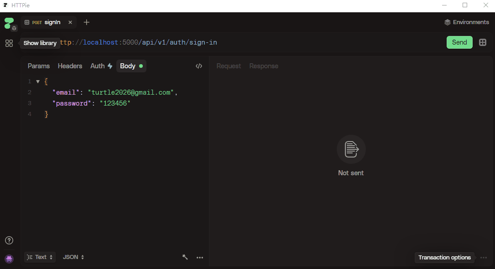
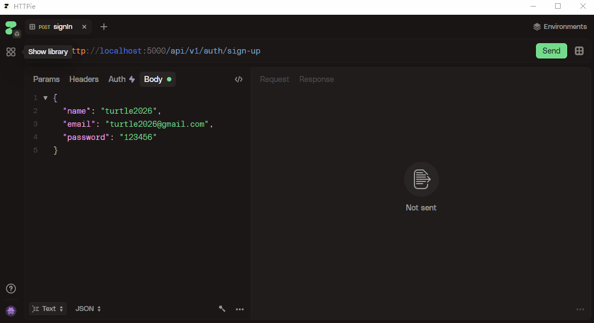
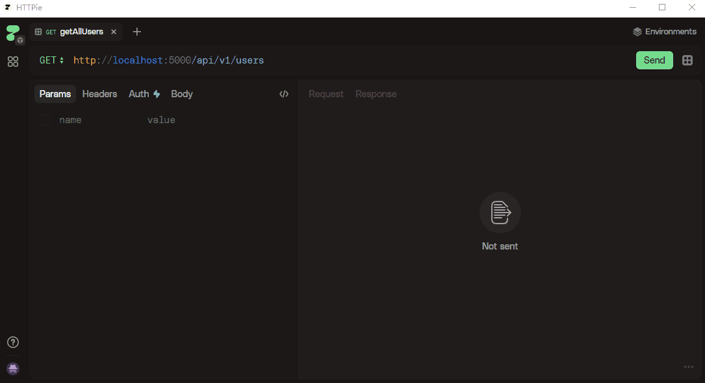
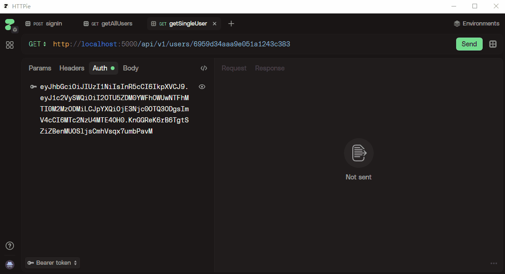

# subscription-tracker

A workflow that sends reminders about upcoming subscription payments, that way you can cancel subscription early and save money instead of waiting until the last minute of the last hour of the last day and you may end up paying eventually.

Using **_JWT_** for authentication, **_Express_** to setup server, **_Mongoose_** for database operation, **_Mongodb Atlas_** for database storage, **_Upstash_** to set up the workflow and **_Arcject_** to secure application(including rate limiting and bot protection), **_nodemailer_** for automatic email sending and **_HTTPie_** for endpoint testing.

```js
1. Launch the main app: npm run dev
2. In a new terminal window, start the QStash service: npx @upstash/qstash-cli dev
```

## Endpoint testing screenshot in development mode

### sign in



### sign up



### get all users



### get single user



### rating Limit


