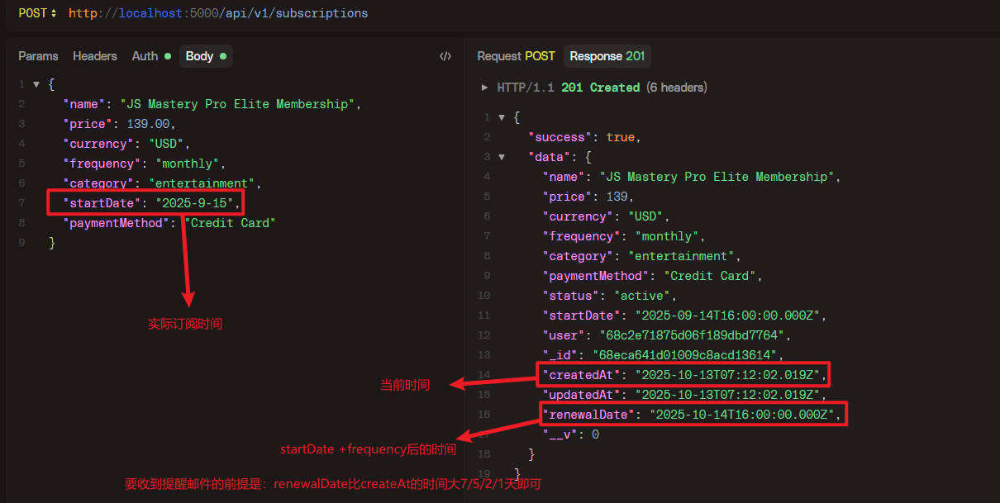

# subscription-tracker

1. Launch the main app: npm run dev
2. In a new terminal window, start the QStash service: npx @upstash/qstash-cli dev
3. A successful setup will trigger a confirmation email, as shown:
   
